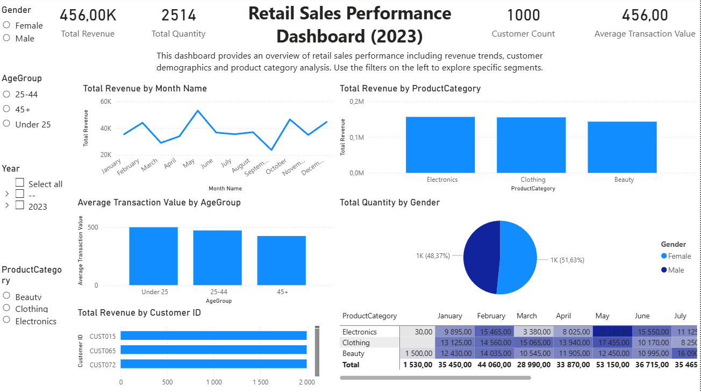

# Retail Sales Analysis – Power BI Dashboard

## Overview
This project presents a complete end-to-end analysis of retail sales data using Power BI.
The dashboard provides actionable insights into:
-	Revenue trends
-	Product performance
-	Customer demographics
-	Seasonal patterns
-	Average transaction value
-	Sales distribution across gender, age groups, and product categories
The goal of this analysis is to support decision-making in retail operations, marketing, forecasting, and product strategy.

---

## Project Structure
Files included in this project:
| File                      | Description               |
|---------------------------|---------------------------|
| dashboard.pbix            | Final Power BI report     |
| retail_sales_dataset.xlsx | Raw dataset (source data) |
| README.md                 | Project documentation     |

---

## Project Objectives
- Identify revenue trends and seasonal patterns  
- Understand demographic distribution of customers  
- Compare product category performance  
- Evaluate average transaction value and contribution per segment 

---

## Dashboard Features
### 1. Key Metrics (KPIs)
The dashboard highlights high-level performance indicators:
-	Total Revenue
-	Total Quantity Sold
-	Customer Count
-	Average Transaction Value

### 2. Revenue Trends Over Time
Visuals include:
-	Monthly Total Revenue Line Chart
-	Year & Quarter Slicers
-	Fully functional date hierarchy (Year -> Quarter -> Month -> Day)
Purpose: Identify seasonal peaks and periods of low performance.

### 3. Product Performance
Includes:
-	Revenue by Product Category
-	Top 10 Customers by Total Revenue
-	Heatmap-style conditional formatting applied to product/month matrix
Purpose: Support product strategy, category management and inventory planning.

### 4. Customer Demographics
Includes visuals for:
-	Average Transaction Value by Age Group
-	Total Quantity by Gender (pie chart)
-	Age Group / Gender slicers
Purpose: Understand who buys the most and which group is most valuable.

### 5. Interactive Slicers
The dashboard allows flexible filtering through:
-	Date (Year -> Quarter -> Month)
-	Product Category
-	Age Group
-	Gender
Slicers allow users to customize the dashboard view for deeper insights.

### Dashboard Preview

---

## Data Source & Preparation
The dataset originates from [retail_sales_dataset.xlsx](../dashboard/retail_sales_dataset.xlsx) and includes columns:
-	Transaction ID
-	Date
-	Customer ID
-	Gender
-	Age
-	Product Category
-	Quantity
-	Price per Unit
-   Total Amount

Additionally, an auxiliary analysis file  
[data_preparation_analysis.xlsx](../data/data_preparation_analysis.xlsx) was used during the exploratory stage to validate data consistency, create intermediate logic, and structure fields before final modelling in Power BI.

---

## Data Cleaning (Power Query)
Performed transformations include:
-	Removing errors
-	Creating dimension tables (Products, Customers, Dim_Date)
-	Ensuring proper data types
-	Extracting year, quarter, month and month name
-	Removing duplicates in dimension tables
-	Creating a star schema

---

## Data Modeling
Architecture: **Star Schema**

#### Fact Table:
- retail_sales_dataset

#### Dimensions:
- Dim_Date  
- Customers  
- Products  

#### Relationships:
- one-to-many  
- single-direction filtering

---

## DAX Measures
Key measures created:
-	Total Revenue
-	Total Quantity
-	Customer Count
-	Average Transaction Value

---

## Skills Demonstrated
This project showcases:
-	Power BI Desktop
-	Power Query (ETL)
-	Data modeling (Star Schema)
-	DAX calculations
-	KPI design
-	Interactive slicers
-	Conditional formatting

---

## How to Use the Report
1.	Open dashboard.pbix in Power BI Desktop
2.	Ensure the Excel source file (retail_sales_dataset.xlsx) remains in the same folder
3.	Use slicers to explore trends by product category, demographics, and time
4.	Inspect model design via Model View
5.	Refresh if needed to trace Power Query transformations

---

## Key Business Insights
-	Electronics is the strongest revenue contributor
-	Sales peak in May, with a significant dip in September
-	Female customers contribute slightly more quantity volume
-	Customers aged 25-44 generate the highest average spend
-	Revenue distribution aligns with seasonal patterns and promotional cycles

---

## Summary

This project demonstrates a complete BI development workflow, combining SQL-based data validation with Power BI data modeling, DAX calculations, and interactive visual design.  
The star schema, custom measures, and slicer-driven interactions provide a scalable foundation for reporting, while the dashboard itself delivers intuitive and operationally relevant insights for end users.

The solution can be easily extended with additional fact tables, new dimensions, or refreshed datasets, making it a flexible base for further analytical work across customer, product and performance domains.

---

## What I Learned
- designing a star schema based on flat input sources
- developing KPIs relevant for retail analytics
- applying DAX aggregation logic

---

## SQL Processing (Supporting Project)
Data preparation logic and classification was performed in SQL.

[SQL logic](../sql/data_quality_project.sql)

See detailed SQL analysis: [README.md](../sql/README.md)

The SQL logic produced supporting result tables, including:
- **ErrorReport** – summary of incorrect records
- **MissingInChecks** – values present in CleanedData but not in Checks
- **MissingInCleanedData** – values present in Checks but not in CleanedData

These outputs served as a foundation for visualisation and trend analysis in Power BI.