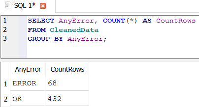
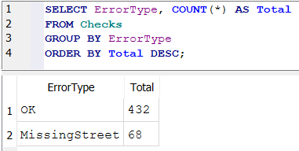
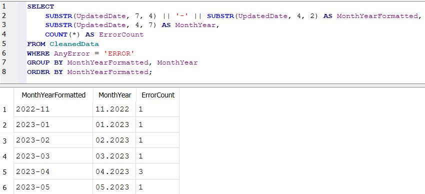
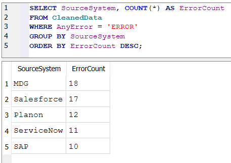
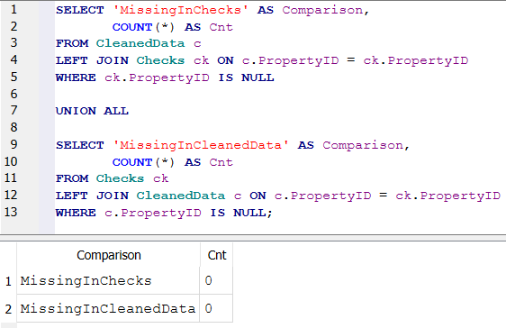

# Data Quality Analysis Project

## Overview
This project focuses on evaluating and understanding the quality of address-related data coming from two sources.
The data was exported from Excel into CSV files and imported into a SQLite database.
The goal of this analysis was to understand where data quality issues occur, quantify their scale, and identify improvement areas useful for operational teams.

---

## Data Sources
The project uses two input datasets:
- [cleaned_data.csv](../data/cleaned_data.csv) - transformed dataset containing standardized address fields
- [checks.csv](../data/checks.csv) - dataset containing validation outputs including error classification
Both files were imported into a SQLite database named:
data_quality.db
This resulted in two tables:
- cleaned_data
- checks

---

## Tools Used
- SQLite + DB Browser for SQLite
- Visual Studio Code (SQL script creation)
- Excel (initial dataset formatting)

---

## Main Goals of the Project
- Measure overall percentage of incorrect records
- Identify the most common types of errors in the dataset
- Determine where errors occur more frequently (countries, sources)
- Detect mismatched records across datasets
- Produce final consolidated report table

---

## Analysis Workflow
1. Exported Excel sheets into UTF-8 CSV files
2. Loaded CSVs into SQLite database
3. Prepared SQL script covering:
   - quality scoring logic
   - distribution analysis
   - trend evaluation
   - cross-table matching
4. Generated output tables for reporting

---

## Key SQL Queries Implemented
- Row counts per table
- Error vs OK distribution
- Percentage of incorrect data
- Breakdown of errors by type
- Mismatch detection (LEFT JOIN logic)
- Trend analysis by month
- Final consolidated report table
Full SQL code is available here:  
[data_quality_project.sql](data_quality_project.sql).

---

## Output Artifacts
The script generates among other things:
- ErrorReport result dataset - final consolidated view of errors
Additionally, the SQL logic returns:
- Count of records present only in cleaned_data
- Count of records present only in checks

---

## Results & Visual Screenshots

### Error Count 
Most of the dataset (~86%) contains valid records, and only ~14% contain data quality issues. This forms the baseline Data-Quality KPI.

| AnyError | CountRows |
|----------|-----------|
| ERROR    | 68        |
| OK       | 432       |

**Query used:**
```sql
SELECT AnyError, COUNT(*) AS CountRows
FROM CleanedData
GROUP BY AnyError;
```



### Error type breakdown
Most errors are related to missing street information, which means data collection processes likely lack mandatory address validation.

| ErrorType      | Total |
|----------------|-------|
| OK             | 432   |
| MissingStreet  | 68    |

**Query used:**
```sql
SELECT ErrorType, COUNT(*) AS Total
FROM Checks
GROUP BY ErrorType
ORDER BY Total DESC;
```



### Monthly Trend of Errors

| MonthYearFormatted | MonthYear | ErrorCount |
|--------------------|-----------|------------|
| 2022-11            | 11.2022   | 1          |
| 2023-01            | 01.2023   | 1          |
| 2023-02            | 02.2023   | 1          |
| 2023-03            | 03.2023   | 1          |
| 2023-04            | 04.2023   | 3          |
| 2023-05            | 05.2023   | 1          |

**Query used:**
```sql
SELECT 
    SUBSTR(UpdatedDate, 7, 4) || '-' || SUBSTR(UpdatedDate, 4, 2) AS MonthYearFormatted,
    SUBSTR(UpdatedDate, 4, 7) AS MonthYear,
    COUNT(*) AS ErrorCount
FROM CleanedData
WHERE AnyError = 'ERROR'
GROUP BY MonthYearFormatted, MonthYear
ORDER BY MonthYearFormatted;
```



### Source systems summary
The largest share of invalid records originates from MDG and Salesforce. This may indicate that these systems do not apply consistent address validation or represent legacy data migrated without full cleanup.

| SourceSystem | ErrorCount |
|--------------|------------|
| MDG          | 18         |
| Salesforce   | 17         |
| Planon       | 12         |
| ServiceNow   | 11         |
| SAP          | 10         |

**Query used:**
```sql
SELECT SourceSystem, COUNT(*) AS ErrorCount
FROM CleanedData
WHERE AnyError = 'ERROR'
GROUP BY SourceSystem
ORDER BY ErrorCount DESC;
```



### Table consistency
Full data consistency between the CleanedData and Checks tables. Each record has a PropertyID match, ensuring that error and structure analyses were performed on the complete, undamaged dataset.

| Comparison           | Cnt |
|----------------------|-----|
| MissingInChecks      | 0   |
| MissingInCleanedData | 0   |

**Query used:**
```sql
SELECT 'MissingInChecks' AS Comparison,
       COUNT(*) AS Cnt
FROM CleanedData c
LEFT JOIN Checks ck ON c.PropertyID = ck.PropertyID
WHERE ck.PropertyID IS NULL

UNION ALL

SELECT 'MissingInCleanedData' AS Comparison,
       COUNT(*) AS Cnt
FROM Checks ck
LEFT JOIN CleanedData c ON c.PropertyID = ck.PropertyID
WHERE c.PropertyID IS NULL;
```



---

## Skills Demonstrated
- SQL filtering and joins
- Data reconciliation logic
- Error classification rules
- Pattern detection in datasets
- Documentation of analytical workflow

---

## Summary
This project demonstrates the ability to:
- import and clean raw CSV data
- validate datasets using structured queries
- extract error patterns
- synthesize results into reusable data structures
- document Data Quality metrics clearly

The output of this analysis directly supports reporting, operational and auditing decisions - for example identifying priority data quality issues and pinpointing affected source systems.

The validated and reconciled dataset served as the foundation for the visual analytics presented in the Power BI dashboard.

---

## What I Learned

- how to build SQL logic to evaluate data quality issues in structured datasets
- writing reconciliation queries to verify dataset consistency
- identifying error patterns based on frequency analysis
- converting raw CSV inputs into SQL-ready structures
- documenting analytical logic in a reusable form

---

## Connection to Power BI dashboard

The dataset and findings from this SQL analysis were subsequently used to build a Power BI dashboard summarizing data quality KPIs.
The dashboard visualizes:
- data quality distribution
- monthly error trend
- share of invalid records across sources
and is linked in this repository.

See dashboard documentation: [README.md](../dashboard/README.md)

If you would like to replicate this analysis:
1. Download the SQL file  
2. Import the datasets into a SQLite database  
3. Run the script step by step using DB Browser or any SQL engine